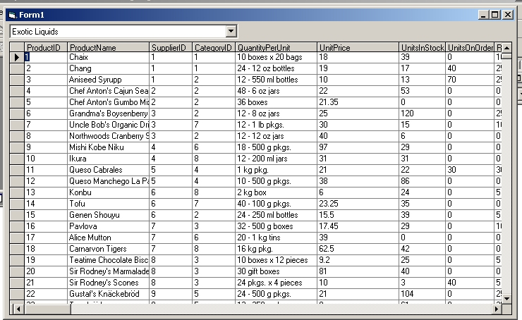



## Simple ADO DataCombo Example

### Description

Explains how to hook a 'lookup' combobox to a data field at runtime. Doesn't use the ADO control - uses pure recordset manipulation. Illustrates what the differences are between 'DataSource' 'RowSource', 'BoundColumn', 'DataField', and 'ListField'.

M$ documentation is truly bad at explaining this topic.
 
### More Info
 

             |
---                |---
**Submitted On**   |2003-04-10 00:35:26
**By**             |[Kamilche](https://github.com/Planet-Source-Code/PSCIndex/blob/master/ByAuthor/kamilche.md)
**Level**          |Beginner
**User Rating**    |4.0 (16 globes from 4 users)
**Compatibility**  |VB 6\.0
**Category**       |[Databases/ Data Access/ DAO/ ADO](https://github.com/Planet-Source-Code/PSCIndex/blob/master/ByCategory/databases-data-access-dao-ado__1-6.md)
**World**          |[Visual Basic](https://github.com/Planet-Source-Code/PSCIndex/blob/master/ByWorld/visual-basic.md)
**Archive File**   |[Simple\_ADO1571754102003\.zip](https://github.com/Planet-Source-Code/kamilche-simple-ado-datacombo-example__1-44648/archive/master.zip)

